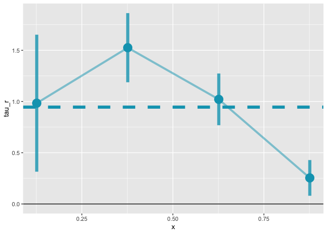

<!-- README.md is generated from README.Rmd. Please edit that file -->

<!-- `devtools::build_readme()` is handy for this. -->

# lls: Local Least Squares for Information Provision Experiments

**If you’re reading this, you’ve found the pre-release version of this
package. Use at your own risk, and please check this repo frequently for
updates. Please open an issue if you find a bug!**

<!-- badges: start -->

[](https://github.com/dballaelliott/LLS/actions/workflows/R-CMD-check.yaml)
<!-- badges: end -->

This R package implements the Local Least Squares (LLS) estimator for
identifying causal effects in information provision experiments. The LLS
estimator consistently estimates Average Partial Effects (APE) even when
there is strong dependence between belief updating and belief effects.

## Installation

You can install the most recent version of `lls` from GitHub with:

``` r
devtools::install_github("dballaelliott/lls")
# build_vignettes = TRUE gives you some local examples with 
devtools::install_github("dballaelliott/lls", build_vignettes = TRUE)
# now you have vignette('lls-intro')
library(lls)
```

## Quick Start

``` r
# Basic usage - Active/Passive Control
result <- iv.lls(
  dat = your_data,
  y = "outcome_variable", 
  x = "posterior",
  r = "learning_rate_variable",
  control.fml = "~ prior + other_controls"
)

# Panel Design
result <- panel.lls(
  dat = your_data,
  dy = "outcome_change",
  dx = "belief_change"
)

# View results and plot
summary(result)
plot(result)
```

## A Simple Example with Simulated Data

The `lls` package comes with a simulated dataset `info.sim` to highlight
how the syntax works and to make some example plots.

``` r
# Load the package
library(lls)
library(data.table)

# Load packaged simulated data
data(info.sim)
setDT(info.sim)  # ensure data.table

info.sim[, alpha_est := (posterior - prior) / (signal - prior)]

# Estimate using IV mode
est <- iv.lls(info.sim, y = "Y", x = "posterior", r = "alpha_est",
    bandwidth = 0.05, control.fml = "prior",
    bootstrap = TRUE, bootstrap.n = 100)
#> Bootstrapping with 100 iterations

# Print summary
print(est)
#> Local Least Squares (LLS) Estimation
#> ====================================
#> 
#> Average Partial Effect (APE):
#>   Estimate:   0.9454
#>   Std. Err:   0.1166
#>   t-value:    8.1096
#>   p-value:   <0.001
#> 
#> Normal CI (95%): [ 0.7169,  1.1739]
#> Percentile CI (95%): [ 0.7435,  1.1968]
#> 
#> Estimation Details:
#>   Bandwidth:   0.0500
#>   Bootstrap reps: 100
#>   Observations: 500
#>   Support points: 500
```

There is a plot function for `lls` objects. It returns a `ggplot`
object, so you can customize it further with standard `ggplot2`
functions.

``` r
plot(est)
```



## Citation

If you use this package, please cite the working paper:

> Balla-Elliott, Dylan (2025). “Identifying Causal Effects in
> Information Provision Experiments.”
> [arXiv:2309.11387](https://doi.org/10.48550/arXiv.2309.11387)

## License

MIT License - see LICENSE file for details.
