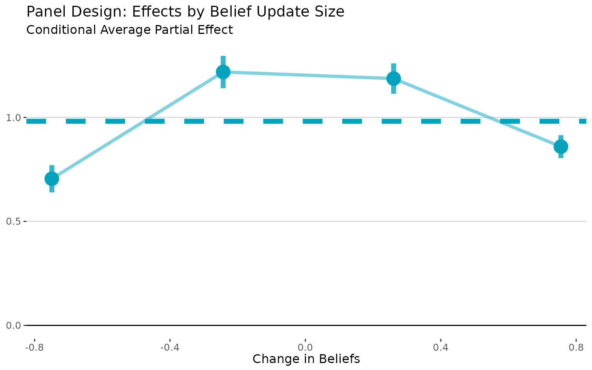
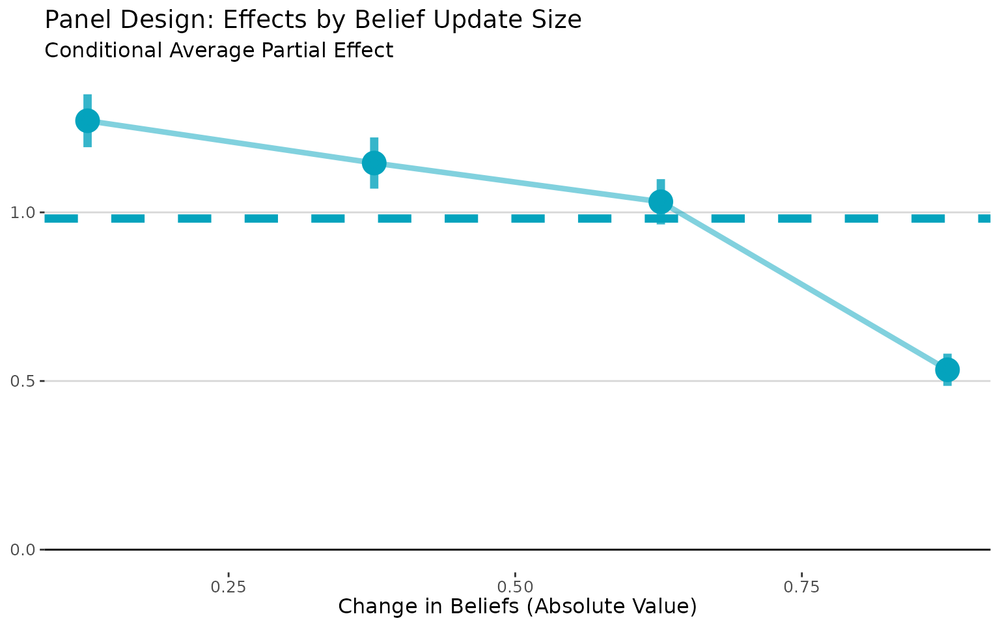
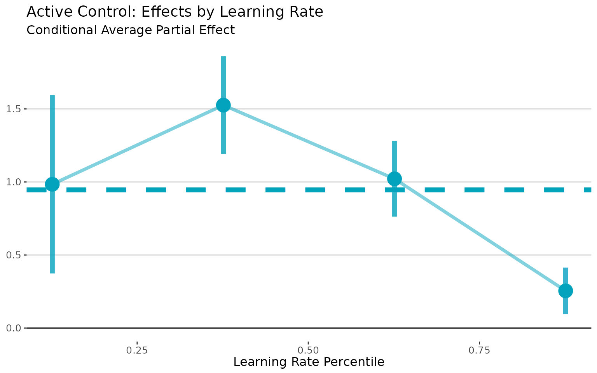
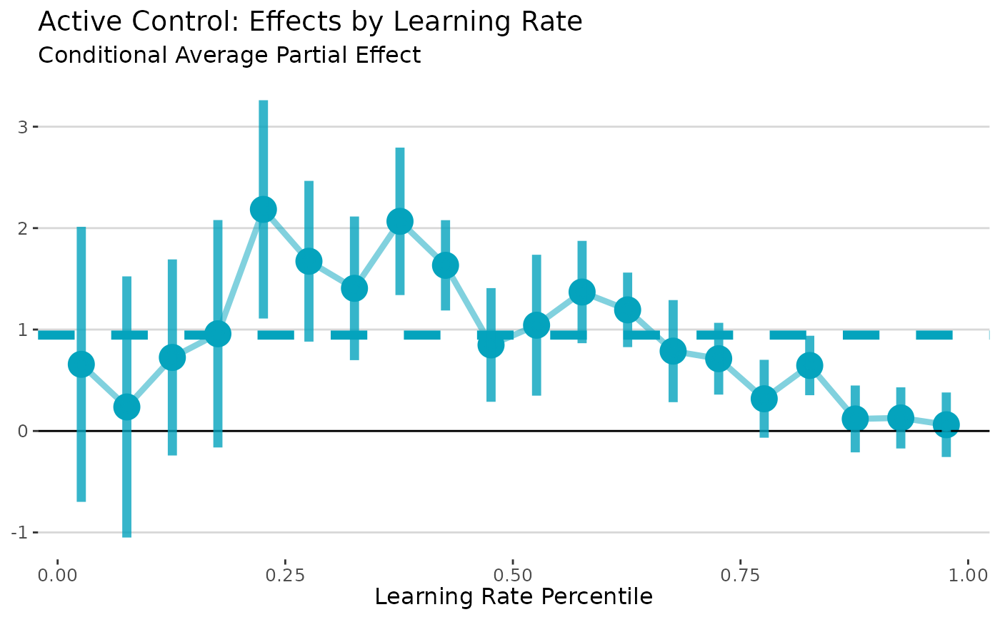
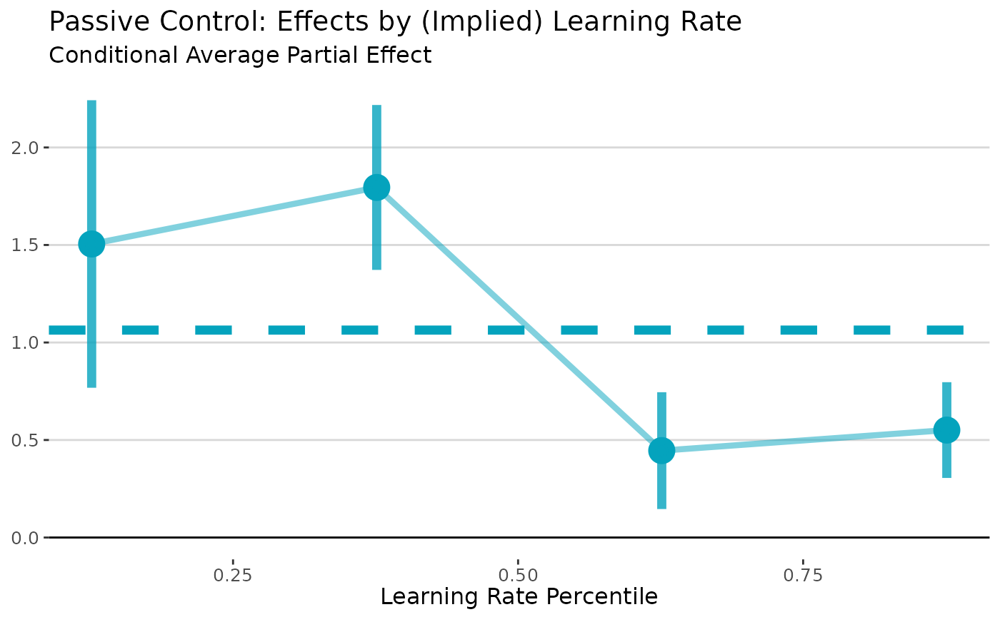

# User's Guide

This R package implements the estimator proposed in [*Identifying Causal
Effects in Information Provision
Experiments*](https://pdfs.dballaelliott.com/info_iv.pdf).

The package handles the multi-step estimation process, including
bootstrap inference. It also provides a simple wrapper to visualize the
CAPE curve, like in the paper. There are lots of options to customize
estimation (and you should experiment with them), but the package also
provides sensible defaults to get you started quickly.

## Implementation Guide

### Simulation Setup

To get started, let’s simulate some data. We’ll design a simulation
where people with larger belief effects (higher values of $`\tau`$) have
smaller belief updates (lower values of $`\alpha`$).[^1] This will make
the plots here look like the ones in the paper.

``` r

# Simulate data for active control design
set.seed(617)
n <- 500

# True APE is 1 - this is what we want to recover
tau <- runif(n)
tau <- tau / mean(tau)  # Normalize so mean is 1

# Make learning rates negatively correlated with belief effects
# People with high tau (big belief effects) have low alpha (small updates)
alpha <- 1 / (tau^2 + 1)
sigma2 <- 1 / (0.5 * tau + 1)

# Introduce endogeneity that affects both priors and outcomes
V <- rnorm(n)
U <- V + rnorm(n)

# Generate the experimental data
dt <- data.table(
    tau = tau,
    alpha = alpha,
    Z = runif(n) > 0.5  # Random treatment assignment
)

dt[, signal := ifelse(Z, 1, -1)]  # High vs low signal
dt[, prior := V + sqrt(sigma2) * rnorm(n) / 5]
dt[, posterior := alpha * (signal - prior) + prior]  # Bayesian updating
dt[, Y := tau * posterior + U]  # Outcome equation
dt[, Y0 := tau * prior + U]  # Counterfactual outcome (in panel, this would be before treatment)

# for panel designs, use changes 
dt[, dX := posterior - prior]  # Change in beliefs
dt[, dY := Y - Y0]  # Change in outcomes
```

### Panel Experiments

Panel designs observe beliefs and actions for same people before and
after information provision. The standard approach is to regress the
change in outcomes on the change in beliefs.[^2]

In these settings, the LLS estimator is a perfect drop-in replacement
that doesn’t require any additional assumptions.

The `lls` command will estimate the CAPE curve conditional on the belief
updates, which we directly observe in the data. Then, post-estimation
commands can be used to access the CAPE curve (`plot`) and the
unweighted average partial effect (APE) and standard errors (`print`).

Importantly, the `lls` command expects to receive the data in changes,
not as a panel with two observations per person. The syntax is simple:

``` r

# Panel LLS using observed changes
panel_lls <- panel.lls(
  dat = dt,  
  dx = "dX",           # Observed belief change
  dy = "dY",           # Observed outcome change
  bootstrap = TRUE,
  bootstrap.n = 200
)

# Visualize how effects vary with belief updating
plot(panel_lls) + 
# plot returns a ggplot object, so we can customize it
labs(title = "Panel Design: Effects by Belief Update Size",
     x = "Change in Beliefs",
     y = "",
     subtitle = "Conditional Average Partial Effect")
```



Sometimes, it’s useful to visualize the CAPE curve with the absolute
value of the belief changes on the x-axis. In this case, it makes the
attenuation bias more apparent, as it shows how effects vary with the
size of belief updates regardless of direction. We can do that with the
`abs.x = TRUE` argument:

``` r

# Visualize how effects vary with belief updating
plot(panel_lls, abs.x= TRUE) + 
labs(title = "Panel Design: Effects by Belief Update Size",
     x = "Change in Beliefs (Absolute Value)",
     y = "",
     subtitle = "Conditional Average Partial Effect")
```



The `plot` command returns a `ggplot` object, so I was able to customize
the plot using standard `ggplot2` commands.[^3]

Finally, we can get the APE and standard errors by printing the `lls`
return object.

``` r

print(panel_lls)
```

    ## Local Least Squares (LLS) Estimation
    ## ====================================
    ## 
    ## Average Partial Effect (APE):
    ##   Estimate:   0.9817
    ##   Std. Err:   0.0198
    ##   t-value:   49.6515
    ##   p-value:   <0.001
    ## 
    ## Normal CI (95%): [ 0.9430,  1.0205]
    ## Percentile CI (95%): [ 0.9347,  1.0177]
    ## 
    ## Estimation Details:
    ##   Bandwidth:   0.0500
    ##   Bootstrap reps: 200
    ##   Observations: 500
    ##   Support points: 500

### Active Control Experiments

Active control experiments compare people who receive “high” vs. “low”
signals.

The standard apparoach to analyze these experiments is to use assignment
to (for example) the high signal as an instrument for posterior beliefs.
The `lls` estimator is justified in this setting under a Bayesian
updating assumption.[^4]

When see how people update their beliefs based on these signals, this
behavior “reveals” their learning rates. Then, we estimate the CAPE
curve conditional on the learning rates and aggregate.

> **Inferring the Learning Rate from the Observed Update**  
> Bayesian updating implies that the posterior $`X`$ is the prior
> $`X_0`$ plus the learning rate $`\alpha`$ times the difference between
> the signal $`S`$ and the prior: $`X = X_0 + \alpha (S - X_0)`$  
> Since we know the prior and the signal, we can rearrange this to
> calculate $`\alpha = \frac{X - X_0}{S - X_0}`$. Once we’ve done that,
> we pass that directly to `lls` as the `r` argument; the local
> regressions will then be estimated condition on the variable we pass
> to `r`.

``` r

# Calculate learning rates from observed updating
dt[, alpha_est := (posterior - prior) / (signal - prior)]

# LLS for active control
active_lls <- iv.lls(
    dat = dt,
    y = "Y",
    x = "posterior", 
    r = "alpha_est",
    control.fml = "prior",
    bootstrap = TRUE
)

# Plot conditional effects by learning rate
plot(active_lls) + 
labs(title = "Active Control: Effects by Learning Rate",
     x = "Learning Rate Percentile",
     y = "",
     subtitle = "Conditional Average Partial Effect")
```



Let’s try taking a more detailed look at the CAPE curve. We aggregated
the binned estimates *after* estimation. That makes it very easy to
change the number of bins, since we don’t have to redo the
bootstrapping.

``` r

# Plot conditional effects by learning rate
plot(active_lls, nbins = 20) + 
labs(title = "Active Control: Effects by Learning Rate",
     x = "Learning Rate Percentile",
     y = "",
     subtitle = "Conditional Average Partial Effect")
```



I think the first figure looks better! There’s a bias-variance tradeoff
– more bins gives us more detail, but at the cost of (much) wider
standard errors. That’s to be expected, though, since we’re using less
and less data to estimate effects in each bin.

It’s important to understand that the `nbins` option only controls how
much to “smooth” in the visualization of the CAPE curve; not how much
smoothing is done in the underlying local regressions (which is
controlled by the `bandwidth` estimation option). Notice that the
horizonal line (the APE) is the same in both figures; that is **not**
affected by `nbins` (but will be affected by the `bandwidth`).

### Passive Control Experiments

Passive control experiments compare treated people to a “pure” control
group that does not receive any new information.

The standard approach is to construct an “exposure instrument” and use
this an instrument for the posterior beliefs.[^5] As in active control
experiments, the `lls` estimator is justified in this setting under a
Bayesian updating assumption.

However, unlike in active control experiments, there is a control group
that the researcher never observes update. In this case, we need to make
an additional assumption that there are some additional control
variables that we can use to predict the learning rate. One potentially
attractive option is the *variance* of the prior belief. Under Bayesian
updating, the learning rate is proportional to the variance of the prior
belief.[^6] In this example, we assume that we know the variance of the
prior beliefs. See the paper for more details on the various options and
necessary assumptions in passive control designs.

``` r

# Create passive control data  
dt_passive <- copy(dt)
dt_passive[Z == 0, posterior := prior]  # Controls keep priors
dt_passive[, Y_passive := tau * posterior + rnorm(n)]

# Case 1: Use prior precision to infer learning rates
dt_passive[, prior_precision := sigma2]  # Higher tau → more precise priors

# Passive LLS (Case 1: observed prior variance)
passive_lls <- iv.lls(
  dat = dt_passive,  
  x = "posterior",           
  y = "Y_passive",           
  r = "prior_precision",
  control.fml = "prior",
  bootstrap = TRUE,
  bootstrap.n = 200
)

# Plot conditional effects by learning rate
plot(passive_lls) + 
  labs(title = "Passive Control: Effects by (Implied) Learning Rate",
     x = "Learning Rate Percentile",
     y = "",
     subtitle = "Conditional Average Partial Effect")
```



## Appendix: An Illustration of Attenuation Bias in TSLS and Panel Regressions

In this simulation, we made the learning rates (α) negatively correlated
with the belief effects (τ). This will make the standard approaches
underestimate the APE because it gives more weight to people who update
their beliefs the most. The true APE is 1, and we expect TSLS to be too
small. We can check this by running a simple TSLS regression:

``` r

# TSLS: biased downward due to correlation between alpha and tau
tsls <- feols(Y ~ 1 + prior | posterior ~ Z, data = dt)
```

As expected, TSLS is biased because it weights individual effects by
their belief updating, and people who update the most (high α) tend to
have the smallest effects (low τ). In this simulation, the TSLS estimate
is 0.757, which is significantly lower than the true APE of 1.

We can also run a panel (first-differences) regression.

``` r

# Panel regression: also biased downward
panel <- feols(dY ~ dX + prior, data = dt)
```

The panel estimate of 0.41 is even more biased downward than the TSLS
estimate.

------------------------------------------------------------------------

If you use this code or the `lls` package in your work, please cite the
working paper ([pdf](https://pdfs.dballaelliott.com/info_iv.pdf)) as

> Balla-Elliott, Dylan (2025). “Identifying Causal Effects in
> Information Provision Experiments.”
> [arXiv:2309.11387](https://doi.org/10.48550/arXiv.2309.11387)

For more information, visit
[dballaelliott.com](https://www.dballaelliott.com/).\*

[^1]: This might have happen if people rationally acquire information
    when it matters for their decisions and then update their beliefs
    less in response to new information.

[^2]: Or, equivalently, to regress the outcome on the belief with
    individual fixed effects.

[^3]: For even more customization, use the `no.plot = TRUE` argument and
    R will return the `data.table` of the conditional effects and
    confidence intervals, which you can then plot however you like.

[^4]: Intuitively, Bayesian updating means that we can use the observed
    update in response to the *actual* signal to infer how people *would
    have* updated in response to the *other* signal. Bayesian updating
    lets us do this because once we know a person’s learning rate
    $`\alpha`$, we know how they would respond to *any* signal.

[^5]: One example of the exposure measure is the sign of difference
    between the signal and the prior. Another example is using the
    difference between the signal and the prior. In both cases, the
    exposure instrument is the interaction between the exposure and the
    instrument, the exposure measure itself is included as a control.

[^6]: We do also need to assume that everyone agrees on the variance of
    the *signal*.
