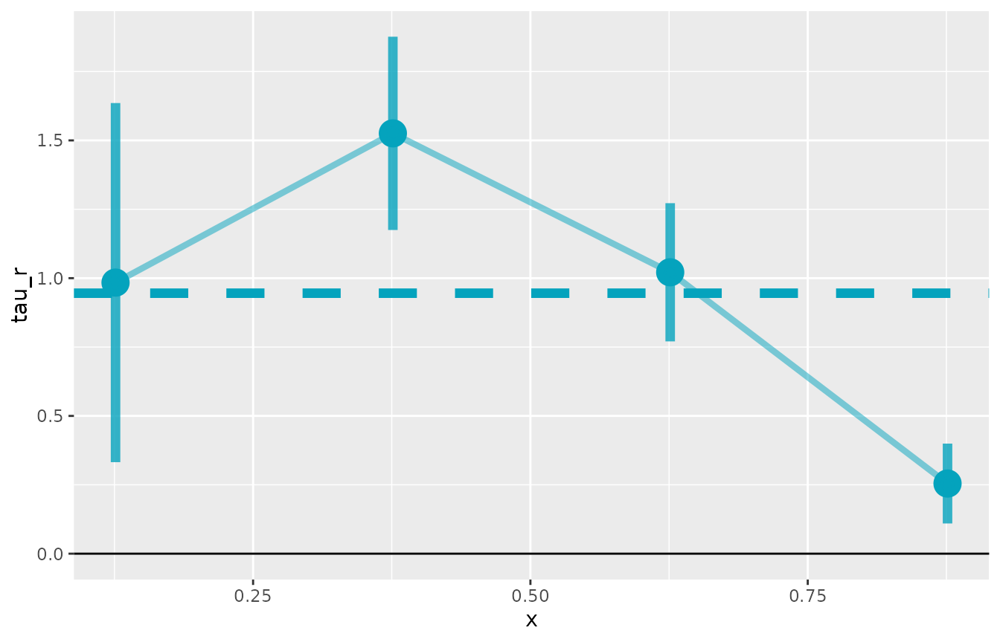

# Quick Start

This R package implements the estimator proposed in [*Identifying Causal
Effects in Information Provision
Experiments*](https://pdfs.dballaelliott.com/info_iv.pdf).

The package handles the multi-step estimation process, including
bootstrap inference. It also provides a simple wrapper to visualize the
CAPE curve, like in the paper. There are lots of options to customize
estimation (and you should experiment with them), but the package also
provides sensible defaults to get you started quickly.

## A Simple Example with Simulated Data

The `lls` package comes with a simulated dataset `info.sim` to highlight
how the syntax works and to make some example plots.

``` r

# Load the package
library(lls)
#> Warning: replacing previous import 'collapse::fdroplevels' by
#> 'data.table::fdroplevels' when loading 'lls'
#> Warning: replacing previous import 'collapse::fdim' by 'fixest::fdim' when
#> loading 'lls'
library(data.table)
#> 
#> Attaching package: 'data.table'
#> The following object is masked from 'package:base':
#> 
#>     %notin%

# Load packaged simulated data
data(info.sim)
setDT(info.sim)  # ensure data.table

info.sim[, alpha_est := (posterior - prior) / (signal - prior)]

# Estimate using IV mode
est <- iv.lls(info.sim, y = "Y", x = "posterior", r = "alpha_est",
    bandwidth = 0.05, control.fml = "prior",
    bootstrap = TRUE, bootstrap.n = 100)
#> Bootstrapping with 100 iterations

# Print summary
print(est)
#> Local Least Squares (LLS) Estimation
#> ====================================
#> 
#> Average Partial Effect (APE):
#>   Estimate:   0.9454
#>   Std. Err:   0.1068
#>   t-value:    8.8550
#>   p-value:   <0.001
#> 
#> Normal CI (95%): [ 0.7362,  1.1547]
#> Percentile CI (95%): [ 0.7477,  1.1394]
#> 
#> Estimation Details:
#>   Bandwidth:   0.0500
#>   Bootstrap reps: 100
#>   Observations: 500
#>   Support points: 500
```

There is a plot function for `lls` objects. It returns a `ggplot`
object, so you can customize it further with standard `ggplot2`
functions.

``` r

plot(est)
```


